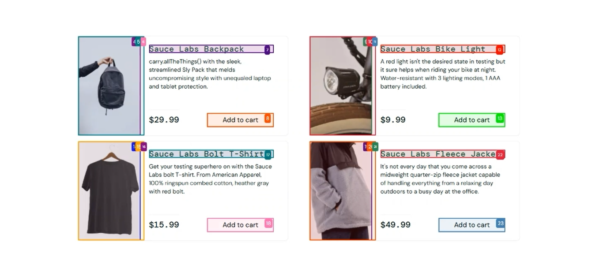

# SauceDemo Web Automation 🚀

This project automates an **end-to-end user workflow** on the [SauceDemo](https://www.saucedemo.com) e-commerce demo site using browser automation tools.

---

## 📌 Project Workflow

The automation script performs the following steps:

1. ✅ Logs in with standard demo credentials:
   - **Username:** `standard_user`
   - **Password:** `secret_sauce`

2. 🛒 Navigates to the product listing and adds a product to the cart.

3. 📦 Verifies the product exists in the cart.

4. ❌ Removes the product from the cart and confirms it's removed.

5. 🔁 Returns to the products (home) page.

6. 🔓 Logs out from the SauceDemo application.

7. 📴 Closes the browser after waiting for 5 seconds.

---

## 🔧 Tech Stack

- 🐍 **Python** (Automation scripting)
- 🌐 **Browser-use / Browser Automation Agent**
- 🤖 **LangChain with Google Gemini API**
- 💻 **PyCharm / VS Code** (for code development)

---

## ▶ Demo Video

To see the automation in action:

> 🎥 You can also [**download the demo video directly**](demo.mp4)

---

##

